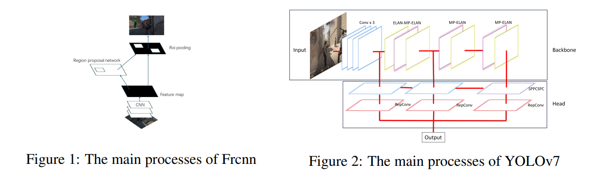
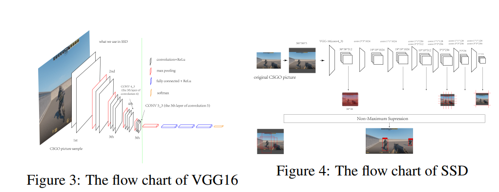
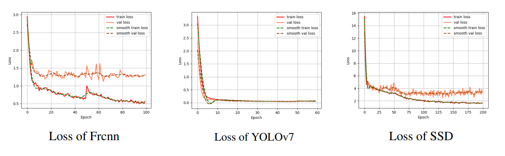
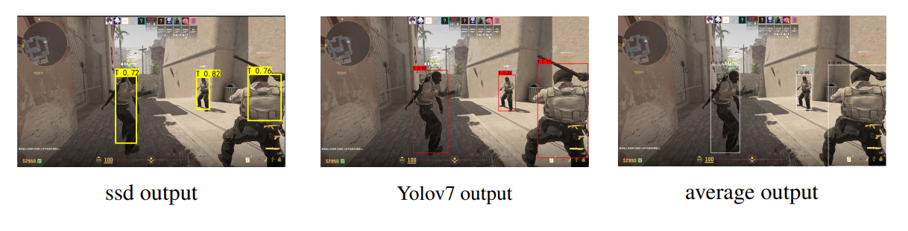
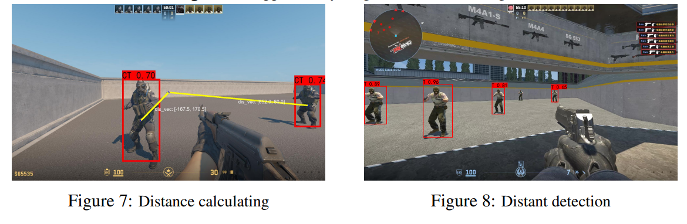

# The-Application-and-Comparison-of-Object-Detection-Algorithm-in-Counter-Strike-2

This repository contains the official implementation for **Object Detection in Counter-Strike 2**.

The main text of the paper can be found at: [IML_project (1).pdf](IML_project%20(1).pdf)

A demo can be seen at [DEMO_vedio](https://www.bilibili.com/video/BV1oT4y147je/?spm_id_from=333.1387.homepage.video_card.click)

This project investigates the application of real-time object detection in Counter-Strike 2 (CS2). We build a **custom in-game dataset** and systematically compare multiple detection frameworks to evaluate their accuracy, speed, and practicality in dynamic gaming scenarios, the data set can be found on [dataset](https://huggingface.co/datasets/skpy/CS2/tree/main). Beyond benchmarking, we demonstrate how detection results can be integrated into gameplay-related applications such as distance estimation and automated aiming.

**Methods**

We implement and compare YOLOv7, Faster R-CNN, and SSD. Key components include:

-Construction of a custom VOC-style CS2 dataset from gameplay footage

-Model training and evaluation under identical settings

-Preprocessing and data augmentation for difficult scenes

-Ensemble-style bounding box fusion using confidence weighting and clustering

**Key Features**

-Custom-built CS2 object detection dataset

-Comparative study of one-stage vs. two-stage detectors

-Model ensemble via weighted bounding box averaging

-Real-time in-game deployment with screen capture

-Applications including auto-aiming and target distance estimation

